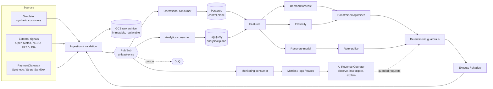

# Praxis Architecture (Phase 0 contract)

Praxis is a closed-loop decision system for a **simulated** API / compute business. All
customers, revenue and outcomes are synthetic unless a view explicitly says otherwise.

## System diagram



The loop is only complete when outcomes flow back into ingestion (right to left above).

## Planes

| Plane | Technology | Holds |
| --- | --- | --- |
| Control | Postgres (Supabase first) | Mutable operational state, decisions, dedupe keys, audit |
| Analytical | BigQuery | Large facts and marts, partitioned by event date |
| Raw archive | Cloud Storage | Immutable / append-only raw and replay data |
| Events | Pub/Sub | Transport; assume at-least-once |
| Scheduled retries | Cloud Tasks (behind an abstraction) | Future payment retry execution |

## Repository layout

```text
src/praxis/        Python package: api, config, logging, tracing, events (envelope, payloads, codec),
                   domain (state machines, projections), simulator (Phase 1), data (Phase 2),
                   streaming (Phase 3 transport, producer, consumers), control (Postgres + Alembic),
                   forecasting (Phase 4), elasticity (Phase 5), pricing (Phase 6 optimiser, audit
                   store), payments (Phase 7 PaymentGateway: Stripe Sandbox + synthetic, webhook
                   inbox, processor), science (the only package joining model output with ground truth)
tests/             unit, contract, simulator, data, streaming, control, integration (emulator),
                   payments (contract suite on both gateways; live Stripe only via stripe-verify)
schemas/events/    Versioned JSON Schemas: envelope and per-event payloads (payloads/)
configs/simulator/ Stable simulator world definition (TOML)
frontend/          Next.js + TypeScript dashboard (placeholder in Phase 0)
infra/terraform/   modules/ (storage, pubsub, bigquery) and envs/dev
docs/              architecture, glossary, conventions, cost guard, ADRs, phase evidence
scripts/           Repository tooling (secret scan, schema export, bounded readiness wait)
```

## Boundaries that must not erode

* The optimiser owns pricing; the LLM never does (ADR 0004). No price executes without a
  persisted decision record; Postgres enforces it by trigger (ADR 0013, `docs/pricing.md`).
* All payment operations go through `PaymentGateway` (ADR 0003). Stripe webhooks are only
  verified and stored in the request; state is re-fetched asynchronously and turned into the
  same internal events the synthetic provider produces (ADR 0014, `docs/payments.md`).
* Retraining never implies promotion (ADR 0005).
* Large-scale tests use the synthetic gateway only (ADR 0006).
* Consumers are idempotent and order-independent; state changes only via transition tables,
  enforced again in Postgres (ADR 0009, `docs/event-backbone.md`).
