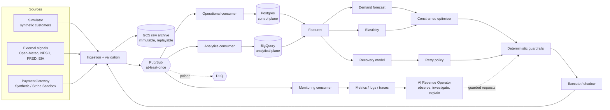

# Praxis Architecture (Phase 0 contract)

Praxis is a closed-loop decision system for a **simulated** API / compute business. All
customers, revenue and outcomes are synthetic unless a view explicitly says otherwise.

## System diagram



The loop is only complete when outcomes flow back into ingestion (right to left above).

## Planes

| Plane | Technology | Holds |
| --- | --- | --- |
| Control | Postgres (Supabase first) | Mutable operational state, decisions, dedupe keys, audit |
| Analytical | BigQuery | Large facts and marts, partitioned by event date |
| Raw archive | Cloud Storage | Immutable / append-only raw and replay data |
| Events | Pub/Sub | Transport; assume at-least-once |
| Scheduled retries | Cloud Tasks (behind an abstraction) | Future payment retry execution |

## Repository layout

```text
src/praxis/        Python package (FastAPI backend, config, logging, tracing, events)
tests/             unit/ and contract/ now; integration/ and others as phases land
schemas/events/    Versioned JSON Schemas (source of truth for event contracts)
frontend/          Next.js + TypeScript dashboard (placeholder in Phase 0)
infra/terraform/   modules/ (storage, pubsub, bigquery) and envs/dev
docs/              architecture, glossary, conventions, cost guard, ADRs, phase evidence
scripts/           Repository tooling (secret scan)
```

## Boundaries that must not erode

* The optimiser owns pricing; the LLM never does (ADR 0004).
* All payment operations go through `PaymentGateway` (ADR 0003).
* Retraining never implies promotion (ADR 0005).
* Large-scale tests use the synthetic gateway only (ADR 0006).
