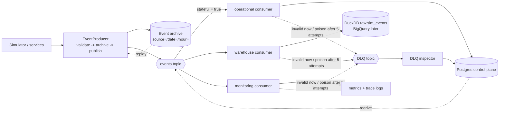

# Event Backbone (Phase 3)

All events are **synthetic** (simulator output). Design rationale: ADR 0001 and ADR 0009.

## Flow



| Component | Module | Guarantee |
| --- | --- | --- |
| Codec | `praxis.events.codec` | Canonical JSON body; attributes carry IDs, type, version, `stateful`; stable decode-error reasons |
| Topology | `praxis.streaming.topology` | Names, filter, retry and DLQ policy (mirrored by Terraform, checked by a test) |
| Producer | `praxis.streaming.producer` | Rejects the whole batch on any invalid event; archives before publishing |
| Archive | `praxis.streaming.archive` | Append-only, content-addressed, checksum verified on read |
| Runtime | `praxis.streaming.runtime` | Decode, bind trace context, classify failures, DLQ routing, latency metrics |
| Operational | `praxis.streaming.consumers.operational` + `praxis.control.store` | Exactly-once *effect*: idempotency row and refold in one transaction |
| Warehouse | `praxis.streaming.consumers.warehouse` | Batched `INSERT ... ON CONFLICT (event_id) DO NOTHING` |
| Monitoring | `praxis.streaming.consumers.monitoring` | Delivery telemetry; best-effort duplicate detection |
| DLQ inspector | `praxis.streaming.consumers.dead_letter` | Every dead letter stored once, with reason, attempts and trace IDs |
| Redrive | `praxis.streaming.redrive` | Operator-triggered republish of decodable dead letters; same `event_id`, fresh `praxis_sent_at` so latency counts from the redrive |
| Transports | `praxis.streaming.memory`, `praxis.streaming.pubsub` | Same semantics; memory broker adds seeded faults |

## Control plane (Postgres, Alembic `src/praxis/control/migrations`)

| Table | Holds |
| --- | --- |
| `processed_events` | Idempotency store `(consumer, event_id)` + trace / correlation IDs |
| `entity_events` | Accepted lifecycle events per aggregate (customer, invoice) |
| `customers`, `subscriptions`, `invoices` | Projections (refolded); state moves guarded by trigger |
| `payment_ledger` | Money collected, one row per invoice, BIGINT minor units |
| `state_transitions` | Audit of applied transitions, keyed by causing event |
| `dead_letters` | Open and redriven dead letters |
| `allowed_state_moves` | Reachability closure of the Python state machines |

State machines: customer `prospect -> converted -> active -> churned`, `prospect -> lost`;
subscription `active -> cancelled`; invoice `open <-> attempting -> paid | uncollectible`.

## Failure handling

| Situation | What happens |
| --- | --- |
| Exact duplicate / redelivery / replay | `processed_events` hit, no-op, ack |
| Out of order (e.g. payment before invoice) | Logged as pending; applied when the predecessor arrives |
| Malformed / unsupported version / unknown type | DLQ immediately (attempt 1), ack |
| Database down | `TransientError`, NACK, exponential backoff (10 s to 300 s) |
| Crash after commit, before ack | Redelivered, then a no-op (idempotency row committed with the effect) |
| Poison (always fails) | NACK x5, then Pub/Sub forwards it to the DLQ (`max_delivery_attempts_exceeded`) |
| Crash storm | In-flight messages can exhaust attempts and be dead-lettered; redrive restores them |

## Commands

```bash
make pg-up / pg-down            # local Postgres (Docker, 127.0.0.1:55432, trust auth)
make pubsub-up / pubsub-down    # Pub/Sub emulator (127.0.0.1:8085)
make test                       # includes control-plane + scenario tests (needs pg-up; done for you)
make pubsub-verify              # producer + consumers over the emulator
make events-check               # chaos smoke vs oracle (used by make check / CI)
make events-local               # 1K x 28d chaos run -> data/events/run_local.json
make events-bench               # live latency on the emulator -> data/events/emulator_bench.json

python -m praxis.streaming --database-url URL migrate
python -m praxis.streaming --database-url URL dlq                        # open dead letters
PUBSUB_EMULATOR_HOST=127.0.0.1:8085 python -m praxis.streaming --database-url URL dlq --redrive
python -m praxis.streaming replay --archive data/events/archive          # emulator
```

## Observability

`StreamMetrics` per subscription: `deliveries`, `redeliveries`, `status_*`,
`nack_transient`, `nack_error`, `dead_lettered_<reason>`, `batch_fallback`, plus latency
samples. `processing` is handler time. `end_to_end` is producer send time
(`praxis_sent_at` attribute) to processed. The DLQ inspector counts `reason_<reason>`.
Phase 11 exports these through OpenTelemetry and adds alerts (DLQ > 0, crash loops,
`pending` older than a threshold).

## Known limitations

* `processed_events` has no retention job yet (must exceed the redelivery and replay window).
* The warehouse consumer writes DuckDB (single writer). BigQuery streaming is deliberately
  not used (cost); the cloud path is GCS archive plus batch loads (ADR 0008).
* Cross-aggregate rules (invoice only for an active customer) are analytical checks (dbt),
  not control-plane constraints, because aggregates may arrive in either order.
* A permanently invalid lifecycle event stays `pending` (visible in `pending_summary`), not
  dead-lettered: online, "never" and "not yet" are indistinguishable.
